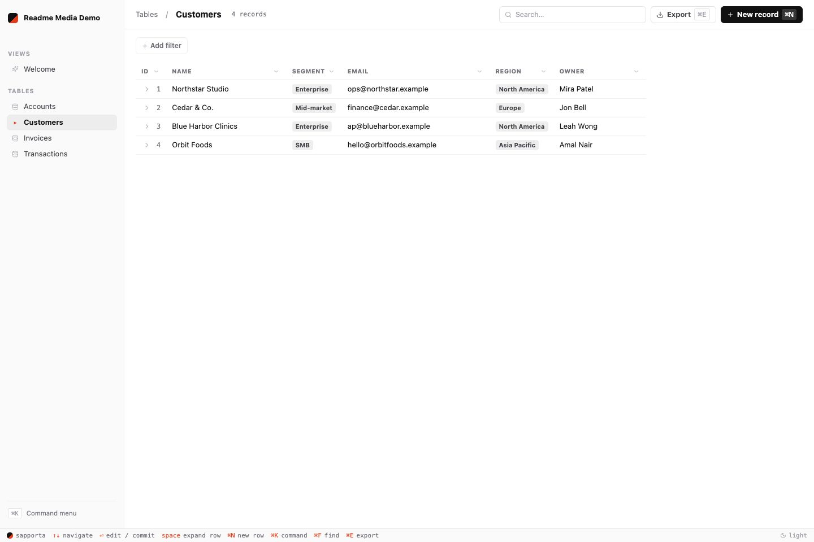
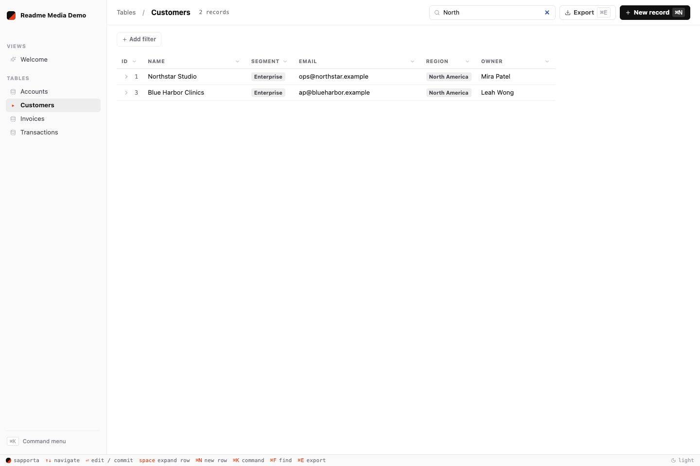
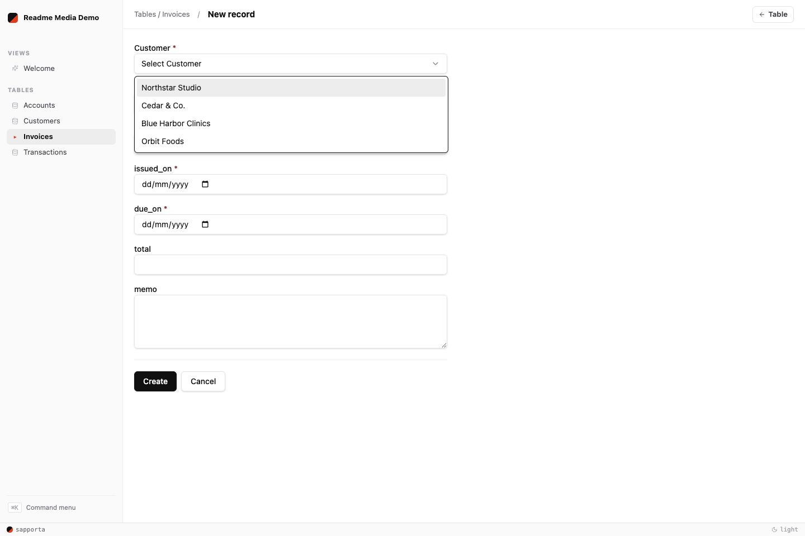
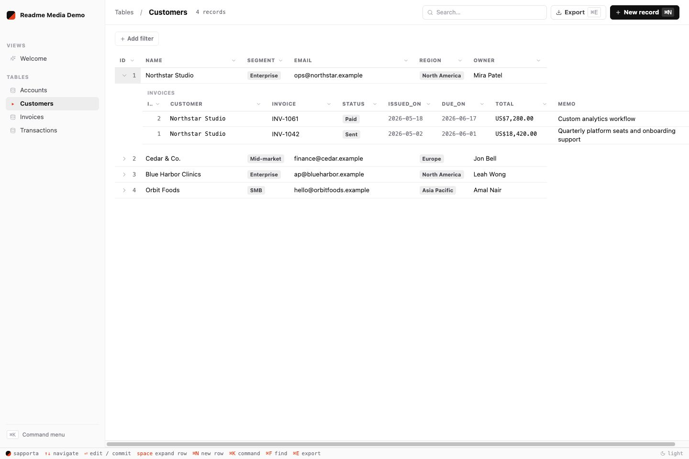
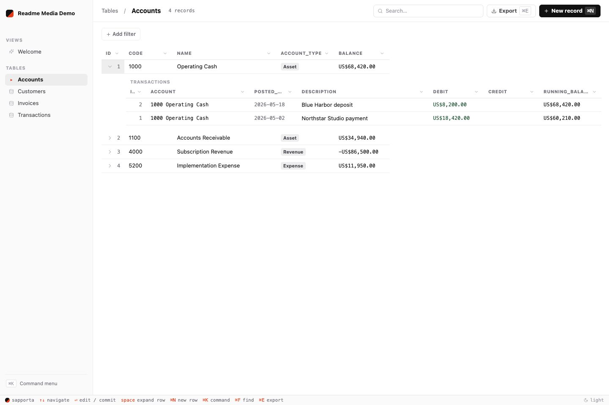

# Sapporta

Sapporta is a TypeScript library for building database applications — personal database systems, multi-tenant SaaS, and report-heavy operational software such as bookkeeping, branch operations, and the drill-down reports people often rebuild in spreadsheets.

This is what Sapporta provides to make building database applications easy:

- REST endpoints for create, read, update, delete, lookup, scoped counts, and
  export
- Data grids with filtering, sorting, and search
- Forms for data entry with validation and keyboard navigation
- Relationship lookups that link related records across tables
- Row-scoped security that ties every read and write to the signed-in user's workspace and role
- Deployment wiring from `npx sapporta init` to running in production
- Reports that drill down from summaries to related detail — a balance links to its transactions, a customer to its orders

Together these make up a working surface that covers a large area of what database applications require.



The project owns its entry points. Sapporta supplies library primitives and a scaffold, but the application remains ordinary TypeScript. The underlying stack — Hono, Drizzle, Better Auth, React, Vite — is used directly, with Sapporta layering in conventions and guard-rails.

Sapporta is a poor fit for static sites, content-first marketing sites, or apps whose main complexity is outside the database.

## Start a Project

```bash
npx sapporta init my-app
cd my-app
pnpm dev
```

The project is ordinary TypeScript:

```text
packages/api/       backend app, boot file, schema, custom routes, reports
packages/frontend/  React app, routes, styles, API client
packages/shared/    contracts and types shared by backend and frontend
```

## Add a Table

Sapporta tables are Drizzle tables wrapped with Sapporta metadata. Schema files live in `packages/api/schema/`.

```ts
import {
  integer,
  sqliteTable,
  sapportaTable,
  text,
} from "@sapporta/server/table";

export const customersTable = sqliteTable("customers", {
  id: integer("id").primaryKey({ autoIncrement: true }),
  workspace_id: text("workspace_id").notNull(),
  name: text("name").notNull(),
  email: text("email"),
});

export const customers = sapportaTable({
  drizzle: customersTable,
  meta: {
    label: "Customers",
    rowScope: "workspaceGlobal",
  },
});
```

`workspaceGlobal` means every member of the active workspace can see the row. Use `workspaceUserScoped` for records owned by one user inside a workspace, and `systemGlobal` for installation-wide reference data such as countries or tax categories.

After changing schema or creating a new one, generate and apply a migration:

```bash
pnpm --filter ./packages/api db:generate --name add_customers
pnpm --filter ./packages/api db:migrate
```

The table is immediately available through Sapporta's table API and UI. Each table gets a grid with filtering, search, sorting, lookups, relationship navigation, exports, and keyboard-friendly data entry. Table routes and views are scoped to the logged-in user's workspace and row permissions, so you can use them directly in product workflows instead of treating them only as an internal admin surface.





Relationship metadata also gives users a way to move through related records without leaving the generated UI.





## Adding Product Logic

Sapporta table routes handle standard list, create, update, delete, lookup, count, and export work. When you need product-specific behavior, add a typed route beside them.

A typical custom route resolves the signed-in workspace user, then uses Sapporta's row-scoped table API:

```ts
import { scopedRows } from "@sapporta/server";

api.register(
  "createCustomer",
  contract.createCustomer,
  async ({ c, request }) => {
    const db = c.get("db");
    const auth = projectAuth.requireWorkspaceUser(c);
    const rows = scopedRows(db, auth, customers);

    const created = await rows.create(request.body);
    return { status: 201, body: { data: created } };
  },
);
```

The `scopedRows(db, auth, table)` call provides bounded selections, paged reads,
streaming scans, lookup, counts, and row writes. Read methods accept ordinary
Drizzle expressions, while Sapporta adds the current row scope before executing
them.

## Libraries & Frameworks

- **Backend**: Hono · Drizzle ORM + SQLite · Zod · Better Auth
- **Frontend**: React 19 · Vite · Tailwind v4 · shadcn/ui · Zustand
- **Shared**: typed REST contracts (sapporta-rest, a minimal fork of ts-rest)
- **Testing**: Vitest + in-memory SQLite

Projects created using Sapporta depend on these libraries directly. Sapporta is a thin set of helpers that provide quality of life improvements, and does not wrap anything inside opaque abstractions.

## Coding-Agent Skills

Sapporta is designed to work well with coding agents. The Sapporta skill teaches an agent the project conventions for tables, relationships, master-detail records, reports, row-scoped routes, and data entry. With the skill installed, you can describe a system at a high level and let the agent inspect the project, propose tables, wire relationships, create reports, and load data through the available APIs.

Install the Sapporta coding-agent skills from the public skills repo:

```bash
npx skills add https://github.com/jasim/sapporta-skills --global
```

## More Docs

- [Schema and Migrations](https://sapporta.com/docs/guides/model-data/schema-changes-and-migrations) - define tables and manage Drizzle migrations
- [Auth and Row Security](https://sapporta.com/docs/reference/server/auth-and-row-security) - build workspace-aware, row-safe apps
- [CLI](https://sapporta.com/docs/guides/discovery/use-the-sapporta-cli) - inspect and work with running Sapporta apps from the command line
- [Deployment](https://sapporta.com/docs/guides/operations/production-builds-and-deployment) - build, migrate, configure, and run Sapporta apps in production
- [Custom Table Grids](https://sapporta.com/docs/guides/generated-surfaces/low-level-tgrid-sessions) - build custom React table workflows on Sapporta table APIs
- [GridCore](https://sapporta.com/grid/reference/grid-core) - build a custom grid screen when table or report components do not fit
- [Server Package](./packages/core/README.md) - use `@sapporta/server`, `scopedRows`, and CLI-backed project commands
- [Shared Package](./packages/shared/README.md) - use shared contracts, filters, date helpers, and client types
- [Honest](./packages/honest/README.md) - use the Hono + ts-rest adapter directly
- [Count Queries](./docs/count-queries.md) - run filtered, grouped, and bounded scoped counts
